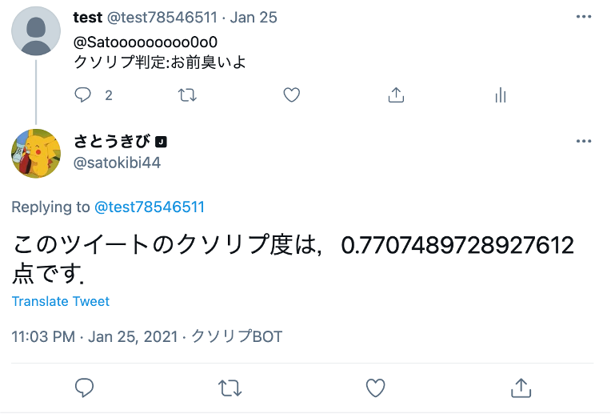

# シン・クソリプ度を測るやつ||
## 概要
Twitterでくるリプライのクソリプ度を画像のように0~1で数値化するAPI



Bert(深層学習)でリプライをベクトル化してクソリプかどうかを判別

✳︎旧クソリプを測るやつの改訂版．
旧クソリプを測るやつはバックエンドをlambdaで動かしていたが，lambdaはGPUが使えなかったり，負荷分散できなかったりするのでECSでAPIを再構築した．
## 使い方
エンドポイント：http://ecs-hands-on-1730037631.us-east-2.elb.amazonaws.com/kusorep/score/

クソリプをmsgパラメータで指定して，GETリクエストを送る

例えば
```python:example.py
url = "http://ecs-hands-on-1730037631.us-east-2.elb.amazonaws.com/kusorep/score/"
param = {'msg': "死ねボケ"}
res = requests.get(url, params=param)
```

## 作った理由
誹謗中傷などのクソリプが原因で自殺する人や心を病んでしまう人が社会問題となっている中で，そのような人たちを救いたいと思ったから．

## 工夫した点
技術的にこだわった点は，インフラをロードバランサー+ECSで構築することで，負荷分散させ，高速でクソリプ度を算出することを実現しました．技術以外でこだわった点は，クソリプを防ぐ様々なアプリが開発されれば，社会は良くなると思ったので，本プロダクトとは別にクソリプ度を計算するAPIのエンドポイントも公開しました．


## 使用技術
Bert(深層学習モデル)，PyTorch(深層学習ライブラリ)，Django(フレームワーク),AWS(ECS,EC2,ECR,load balancer)Docker,github actions
## インフラ構造
 
