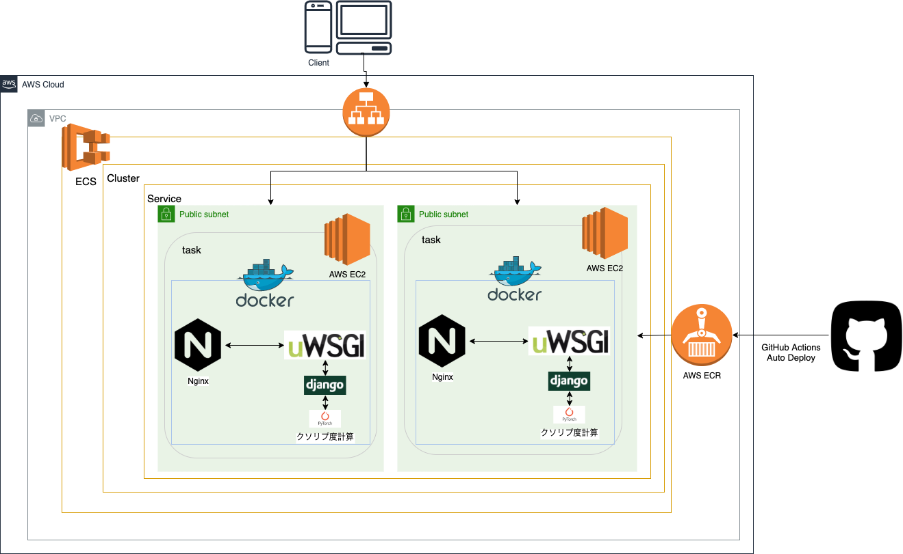

# [WIP]シン・クソリプ度を測るやつ
## 概要
旧クソリプを測るやつの改訂版．
旧クソリプを測るやつはバックエンドをlambdaで動かしていたが，lambdaはGPUが使えなかったり，負荷分散できなかったりするのでECSでAPIを再構築

## 使用技術
Bert(深層学習モデル)，PyTorch(深層学習ライブラリ)，Django(フレームワーク),AWS(ECS,EC2,ECR,load balancer)Docker,github actions
## インフラ構造


## memo

### タスクの登録
```
aws ecs register-task-definition --cli-input-json file://kusorep-task-definition.json
```

### タスクの実行
```
aws ecs run-task \
--cluster kusorep-cluster \
--task-definition kusorep-task-definition \
--overrides '{"containerOverrides": [{"name":"Django-Bert","command": ["sh","-c","uwsgi --socket :8001 --module Kusorep_API.wsgi --py-autoreload 1 --logto /tmp/mylog.log"]}]}' \
--launch-type FARGATE \
--network-configuration "awsvpcConfiguration={subnets=[subnet-08bbb751696bf5657],securityGroups=[sg-0f2348e9f181c50dd],assignPublicIp=ENABLED}"
```

### サービスの作成
```sh
aws ecs create-service \
--cluster kusorep-cluster \
--service-name kusorep-service \
--task-definition kusorep-task-definition \
--launch-type FARGATE \
--desired-count 1 \
--network-configuration "awsvpcConfiguration={subnets=[subnet-08bbb751696bf5657],securityGroups=[sg-0f2348e9f181c50dd],assignPublicIp=ENABLED}"
```